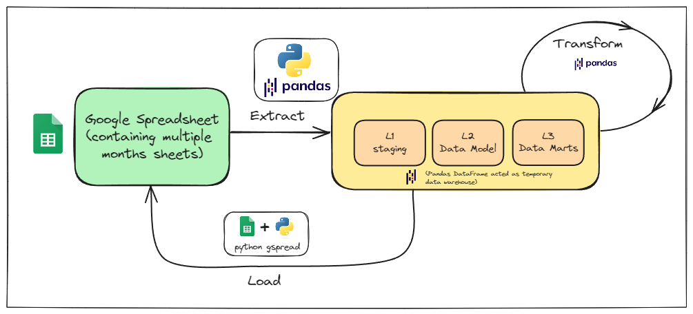
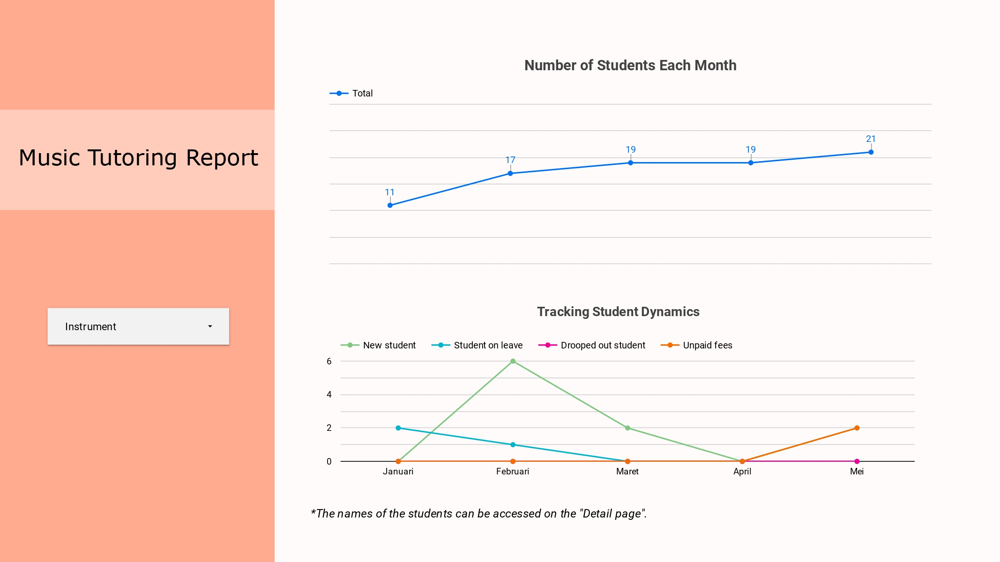
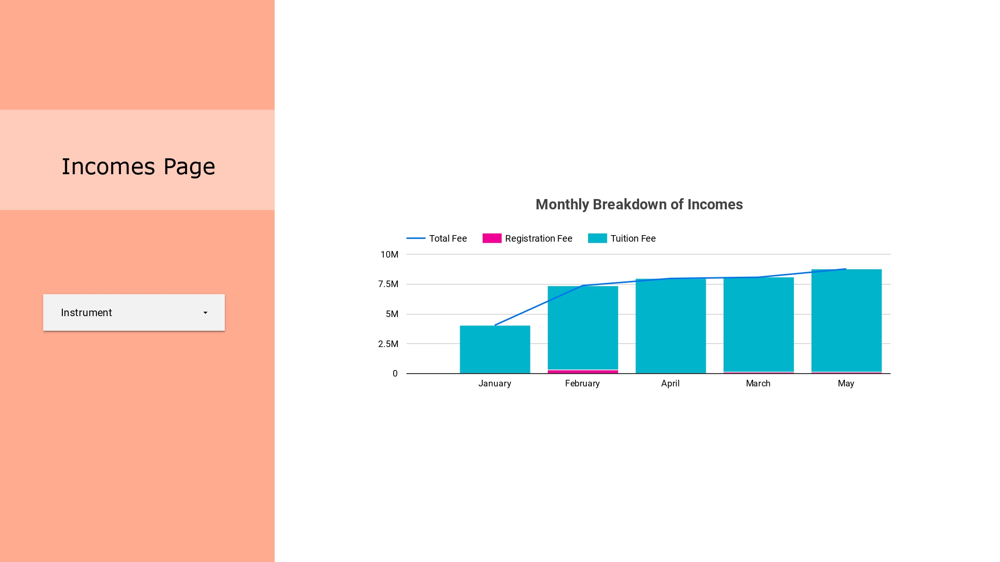
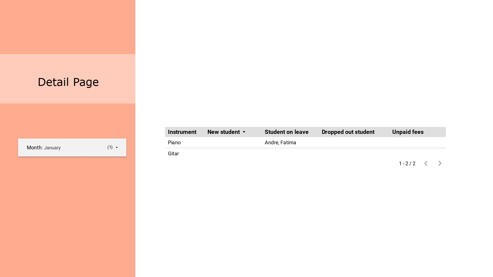

# Music Tutoring Data Engineering Project

This project focuses on data engineering for a relatively small dataset related to a music tutoring service. The main objective is to process the data for visualization purposes.

The data, which is manually input by an admin, is sourced from Google Spreadsheets. The processed data will be visualized using Looker Studio. Given the small size of the data (less than 1000 rows), we use pandas for ETL (Extract, Transform, Load) operations. The aggregated results for Looker are stored in the same spreadsheet but on a new sheet. The pandas DataFrame acts as a temporary data warehouse that is cleared with each run. The ETL process is scheduled using GitHub Actions to run at the beginning of each month.

<p align="center">
  
<p>

Additionally, unit tests are included and executed using pytest.

## Data Source
As previously mentioned, the data for this project is sourced from a Google Spreadsheet. The following link provides access to the spreadsheet:

**[ [Google Spreadsheet Link](https://docs.google.com/spreadsheets/d/1kaci6AtLCpOENLcfJ2RvtgMOph1FcBumvJ2pkRBQhro/edit?usp=sharing) ]**

> ❗Please note that the data in the spreadsheet is **dummy data** that has been modified for the purposes of this project. 

## Tech Stack
- **Pandas**: For ETL operations and data manipulation.
- **Looker Studio**: For data visualization.
- **GitHub Actions**: For scheduling and automation of ETL processes.
- **Google Cloud**: For Google Spreadsheets and service accounts.

## Dashboard
Here is the link to the Looker Studio dashboard built using the processed data:

**[ [Looker Studio Dashboard](https://lookerstudio.google.com/reporting/a7eb91ba-d603-4083-80a3-49a0dd73c775) ]**

<p align="center">
  
<p>

<p align="center">
  
<p>

<p align="center">
  
<p>

## How to reproduce this project?
1. Clone the repository:
```bash
git clone https://github.com/marliyehez/minimalistic-google-spreadsheet-etl.git
cd minimalistic-google-spreadsheet-etl
```

2. Install the required Python packages:
```bash
pip install -r requirements.txt
```

3. Create a service account that has access to read and write Google Spreadsheets and download the JSON key file.

4. Set the following environment variables:
    - `sheet_url`: The URL of the Google spreadsheet that contains the raw data.
    - `service_account_path`: The path to the service account JSON key file.
    - `recap_sheet_title`: The title of the new sheet in the Google spreadsheet that will store the aggregated data for Looker Studio.
    - `month`: (Optional) The month for which to generate the data. If not provided, the current month will be used. Specify the month using Indonesian month names, such as "Januari", "Februari", "Maret", etc.

5. Running ETL Locally
To run the ETL process locally, execute:
```bash
python main.py
```

6. Running Tests
To run the unit tests, use:
```bash
pytest -v
```

7. Scheduling ETL with GitHub Actions
The ETL process is scheduled to run at the beginning of each month using GitHub Actions. The workflow configuration is located in `github/workflows/actions.yml.`

8. Open Looker Studio and create a new Looker Studio report.

9. Connect to the Google Sheets data source and select the new sheet that was created by the ETL script.

10. Create your visualizations.
